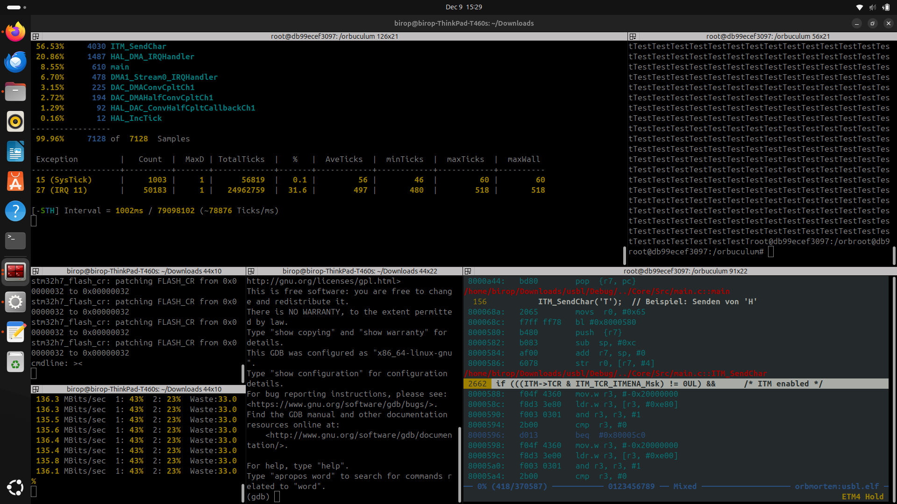
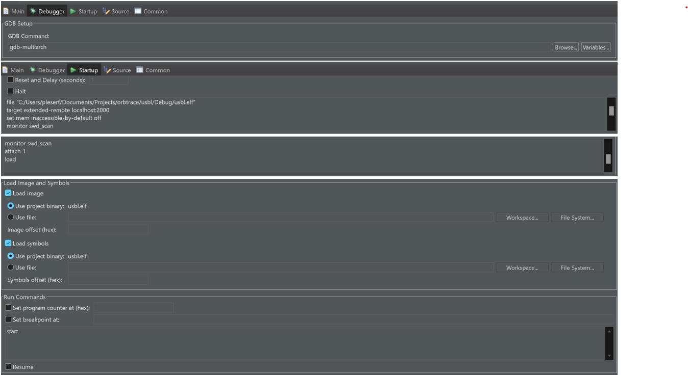

# Orbuculum Trace


## Only for Linux (Config for STM32H743 parallel trace)
**Note:** This setup is for Linux only. On Windows, passthrough USB devices do not work with Docker, making it impossible to use trace and debug features in parallel.

## Installation Linux

1. Install **Docker**

2. Download **start_terminator_layout.sh** and **Dockerfile**. Place them in the same folder.

3. Open **start_terminator_layout.sh** and modify the specified line to include the path to your **.elf** file:

    docker run -itd --privileged \ \
    -p 2000:2000/tcp \ \
    -v /dev/bus/usb:/dev/bus/usb \  
    **-v /home/birop/Downloads:/home/birop/Downloads \  <--update this line**\
    --name orbtrace-container \ \
    Orbtrace


4. **Optional: Customize Orbtrace settings**\
You can modify your Orbtrace configuration, e.g., to use 4 parallel lines (default):
`xdotool type "docker exec -it ${CONTAINER_ID} bash -c 'orbuculum -O \"-T 4\" -m 500; exec bash'"`

5. **Start Docker**\
Navigate to the folder containing **start_terminator_layout.sh** and **Dockerfile**. Then execute the following commands:
```
sudo apt-get install xdotool
chmod +x start_terminator_layout.sh
./start_terminator_layout.sh
```

6. **Wait for 2 minutes**\
After execution, five terminal windows should appear:

- Blank terminal
- Blackmagic
- Orbuculum
- Orbuculum Docker
- GDB Multiarch

**Note:** If you need additional Orbuculum terminals, run:

`docker exec -it orbtrace-container bash`

## Installation Windows
### Requirements
Download and install MSYS2.\
Open the mingw64 shell for all commands.

### Step 1: Update System and Install Required Packages

```
pacman -Syu
pacman -S base-devel mingw-w64-x86_64-toolchain git
pacman -S mingw-w64-x86_64-libusb mingw-w64-x86_64-hidapi
git clone https://github.com/blackmagic-debug/blackmagic.git
cd blackmagic

pacman -S mingw-w64-x86_64-python3
```

### Step 2: Install Meson
To set up Meson, run the following command:
`pacman -S mingw-w64-x86_64-meson`

### Step 3: Build the Blackmagic Debug Application
Navigate to the Blackmagic project folder and compile the application:

```
cd blackmagic
meson setup build --force-fallback-for=libusb
meson compile -C build
ninja -C build
```

### Step 4: Run the Application
Start the Blackmagic Debug Application with:\

`~/blackmagic/build/blackmagic -v 5`\

Once started, **TCP port 2000** will be open and ready for connections.

### Step 5: Install Orbuculum
**Option 1:** Download Prebuilt Binaries
Download the Orbuculum binaries from the following link:
[Orbuculum Binaries](https://github.com/orbcode/orbuculum/actions/runs/12271929254
)
(client orbmortem is not included)

**Option 2:** Build Orbuculum from Source
If you prefer to build Orbuculum yourself, follow the instructions in the Orbuculum GitHub README. Example build commands:[Orbuculum Github](https://github.com/orbcode/orbuculum)


### Step 6: Install GDB with Multiarch Support

To debug multiple architectures, install GDB with multiarch support:

`pacman -S mingw-w64-x86_64-gdb`

### Step 7: Add Environment Variables

Add the following directories to your Environment Variables:

1. Blackmagic binaries: Path to the Blackmagic executable (e.g., `~/blackmagic/build`).
2. Orbuculum clients: Path to the **Orbuculum** client executables (e.g., `~/orbuculum/build`).

This ensures that you can run both tools globally from the command line.


## Enable ITM/DWT/ETM in Your Code (main.c)

Add the following code to your **main.c** file:

```
#define DBG_TER (*(volatile uint32_t *)0x5C000E00)

__HAL_RCC_GPIOE_CLK_ENABLE(); //parallel tracing
GPIO_InitTypeDef  GPIO_InitStruct;
GPIO_InitStruct.Mode = GPIO_MODE_AF_PP;
GPIO_InitStruct.Pull = GPIO_NOPULL;
GPIO_InitStruct.Speed = GPIO_SPEED_FREQ_VERY_HIGH;
GPIO_InitStruct.Pin = GPIO_PIN_2 | GPIO_PIN_3 | GPIO_PIN_4 | GPIO_PIN_5 | GPIO_PIN_6;
GPIO_InitStruct.Alternate = GPIO_AF0_TRACE;
HAL_GPIO_Init( GPIOE, &GPIO_InitStruct );


RCC->APB4ENR |= (1 << 21);
DBGMCU->CR |= DBGMCU_CR_DBG_TRACECKEN;
DBG_TER |= (1 << 0);

ITM_SendChar(‘t‘);   // to send character ‘t‘ on ITM port
```

## Debugging Options
### Using GDB Terminal
1. Start a GDB session with these commands:
```
file path/to/file.elf 
target extended-remote localhost:2000
set mem inaccessible-by-default off
monitor swd_scan
attach 1
load
start
```


### Using STM32CubeIDE
1. Create a new **GDB Hardware Debugging** configuration.
2. Add your specific settings for debugging.



## Enable and start ITM/DWT/ETM in GDB Terminal
1. Download **gdbtrace.init** \
Place it in the same directory as your **Dockerfile**.
2. **Modify the Debugger Console (terminal or STM32CubeIDE)**\
Add the following commands to the Debugger console:

```
source path/to/gdbtrace.init	
enableSTM32TRACE 4
dwtSamplePC 1
dwtSyncTap 3
dwtPostTap 1
dwtPostInit 1
dwtPostReset 10
dwtCycEna 1
ITMId 1
ITMGTSFreq 3
ITMTSPrescale 3
ITMTXEna 1
ITMSYNCEna 1
ITMEna 1

dwtTraceException 1
ITMTSEna 1

ITMTER 0 0x00000009

startETM


```


## Orbuculum clients
1. **orbmortem**: Observe the program's exact behavior.\
`orbmortem -P ETM4 -e path/to/file.elf`

  -   press `h` to halt
  -   press `?` for info

2. **orbtop**: Monitor task workloads.\
`orbtop -E -e path/to/file.elf `
3.  **orbcat**: Watch ITM port output like `printf`:\
`orbcat -c 0,”%c”`

**Note**: 
Use `-h` to access the help menu, e.g., `orbmortem -h`.

## Troubleshooting:
1. **If Blackmagic hangs:**
- 	`Ctrl + c`
- 	`blackmagic -v 5`

2. **If you encounter a permission error:**
	
    `Sudo command`

3. **For other microcontrollers:**\
Modify the base addresses in the gdbtrace.init and the GDB terminal commands accordingly. Additional information can be found on the [Orbuculum GitHub page](https://github.com/orbcode/orbuculum) or [Discord forum](https://discord.gg/P7FYThy).

